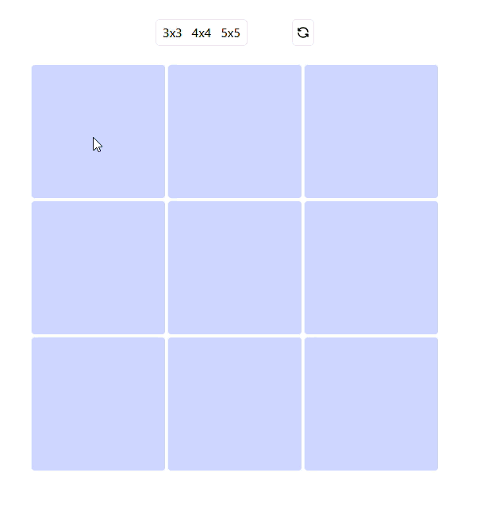
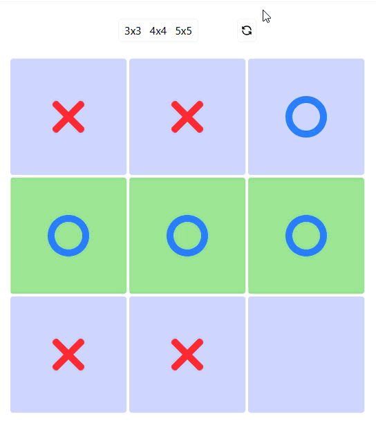

# Tic-Tac-Toe vs. Gemini AI

[Live Demo](https://tic-tac-toe-sia.netlify.app/)

A full-stack tic-tac-toe game where you play against a Gemini-powered AI 
opponent. Supports 3x3, 4x4, and 5x5 boards.

Gameplay demo:



---

## Architecture

The React frontend sends the current board state to a FastAPI backend, 
which relays it to the Gemini API (`gemini-2.5-flash`) with a prompt 
engineered to return a valid, strategic move. The backend validates the 
move before sending it back to the frontend, which updates the board.

---

## Frontend

Built with React 19.

**Features:**
- AI opponent powered by Gemini
- Selectable board sizes (3x3, 4x4, 5x5)
- Real-time move updates while the AI is "thinking"

**Tech Stack:** React 19, TypeScript, Tailwind CSS, Vite

### Prerequisites
Node.js 18+

### Installation
```bash
cd client
npm install
npm run dev
```

---

## Backend

Built with FastAPI, manages game logic and Gemini AI integration.

**Features:**
- Lightweight REST API with automatic documentation
- Gemini AI integration via the `google-genai` client for move calculation
- Full board-state tracking, move validation, and win/draw detection
- Test suite covering game logic, win/draw detection, and mocked Gemini 
  API responses (`pytest`, `unittest.mock`)

**Tech Stack:** Python 3.14+, FastAPI, `google-genai`, `anyio`, `uvicorn`

### Prerequisites
Python 3.14+ and a Gemini API key from [Google AI Studio](https://aistudio.google.com/).

### Installation
```bash
cd server
python -m venv .venv

# Activate the virtual environment
.venv\Scripts\Activate.ps1      # Windows (PowerShell)
source .venv/bin/activate       # macOS/Linux

pip install -r requirements.txt
# For running tests, also: pip install -r requirements-dev.txt

# Add your Gemini API key
echo "GEMINI_API_KEY=your_key_here" > .env
```

### Running
```bash
python -m fastapi dev app/main.py
```